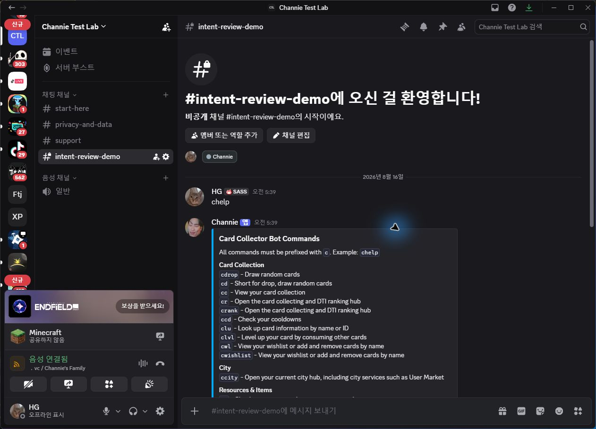
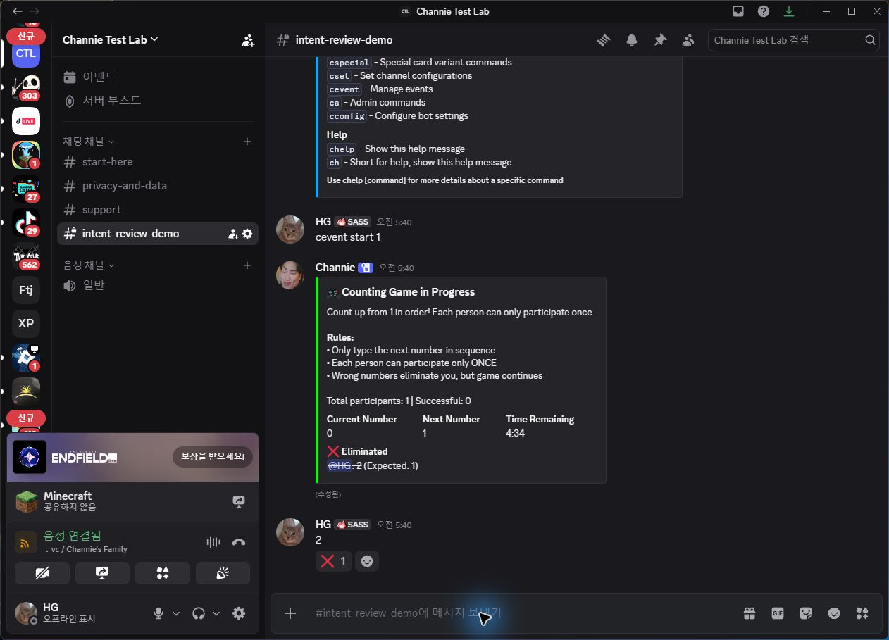

# Channie Message Content Intent evidence

This page documents why Channie requires Discord's Message Content privileged intent.

Channie uses buttons and select menus where practical. Message content remains necessary for its established `c`-prefixed command interface, real-time multiplayer game answers, votes, multi-step text flows, and image attachments submitted to configured features.

The bot's message router handles only recognized commands, administrator-configured feature channels, and active game or user sessions. Unrelated messages outside those contexts are ignored by application logic. Message content is not used for advertising or behavioral profiling.

## Prefix-command evidence

The screenshot shows a user entering `chelp` in the private `intent-review-demo` channel and Channie returning its help message. Without Message Content, the bot cannot read the command text from an ordinary guild message.

## Real-time game evidence

The screenshot shows Channie's Counting Game processing a number entered directly into the channel. Live games such as Counting Game, quizzes, dungeons, Who's This?, and Werewolf require rapid free-form or numeric input that cannot be represented adequately by a fixed set of buttons or select-menu options.

## Data handling

See the public [Privacy Policy](../../PRIVACY.md) and [Terms of Service](../../TERMS.md) for information about storage, retention, user choices, and data requests.
